# Spring PetClinic DevOps Project 🚀

This is my end-to-end DevOps project based on the Spring PetClinic application.

The goal of this project was to automate the complete CI/CD pipeline starting from source code to deployment on Amazon EKS using Jenkins.

This project helped me understand how different DevOps tools work together in a real-world workflow.

---

# Project Architecture

Developer
↓
GitHub
↓
Jenkins Pipeline
↓
Maven Build
↓
SonarQube Code Analysis
↓
Nexus Artifact Repository
↓
Docker Image Build
↓
DockerHub
↓
Amazon EKS
↓
Spring PetClinic Application

---

# Tools Used

- Git & GitHub
- Jenkins
- Maven
- SonarQube
- Nexus Repository
- Docker
- DockerHub
- Kubernetes
- Amazon EKS
- Terraform
- AWS EC2

---

# Infrastructure

### EC2 Instances

- Jenkins Server
- SonarQube + Nexus Server
- EKS Control Node
- Worker Node 1
- Worker Node 2

Terraform was used to provision the Amazon EKS Cluster and worker nodes.

---

# Jenkins Pipeline

The Jenkins pipeline performs the following stages:

1. Git Checkout
2. Maven Build
3. SonarQube Scan
4. Upload Artifact to Nexus
5. Docker Image Build
6. Docker Login
7. Push Image to DockerHub
8. Deploy Latest Image to Amazon EKS

---

# Kubernetes

The application is deployed using:

- Deployment
- Service (LoadBalancer)

Rolling updates are used for application deployment.

---

# Project Structure

spring-petclinic
│
├── Jenkinsfile
├── Dockerfile
├── pom.xml
├── k8s
│   ├── deployment.yaml
│   └── service.yaml
│
├── terraform
│   ├── main.tf
│   ├── variables.tf
│   ├── providers.tf
│   ├── outputs.tf
│   └── terraform.tfvars
│
└── src

---

# Screenshots

## Project Structure

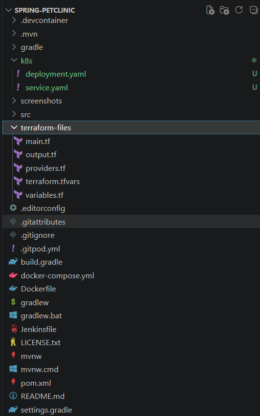

---

## Jenkins Pipeline

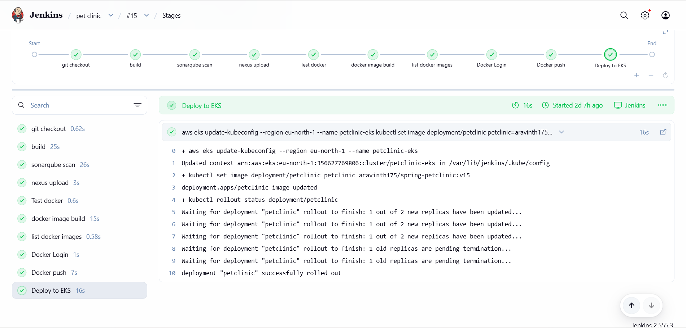

---

## SonarQube Quality Gate

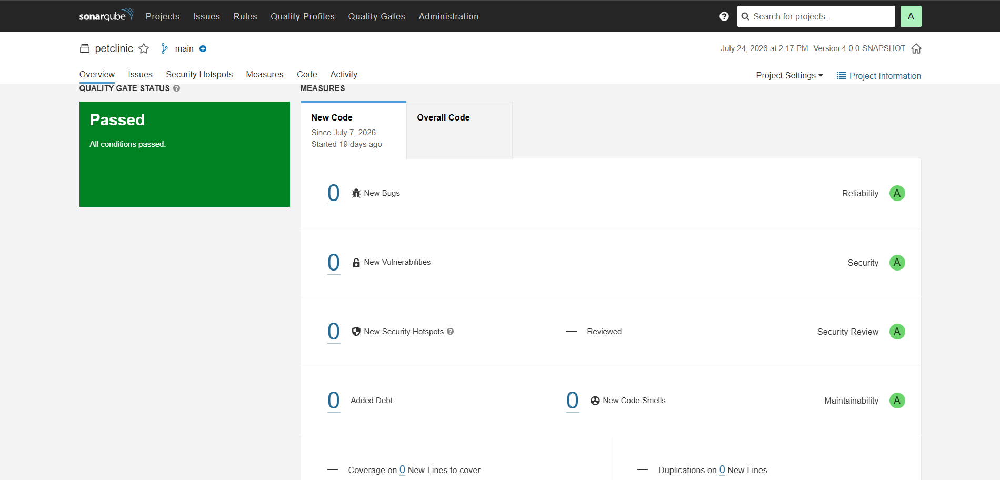

---

## Nexus Repository

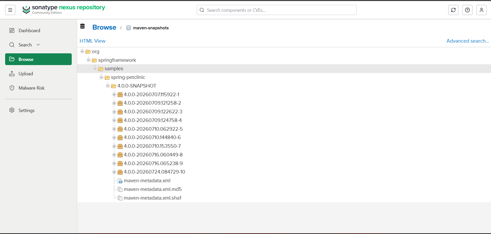

---

## DockerHub Repository

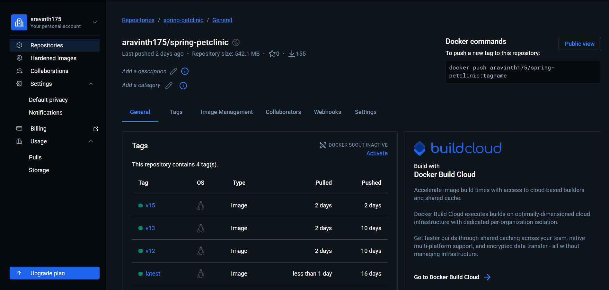

---

## Docker Images

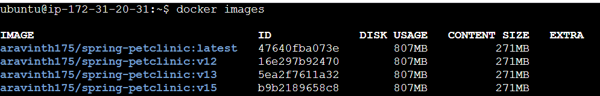

---

## Docker Containers

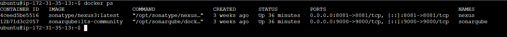

---

## Terraform Plan

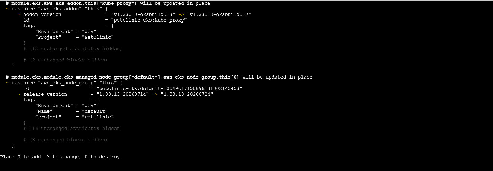

---

## Amazon EKS Cluster

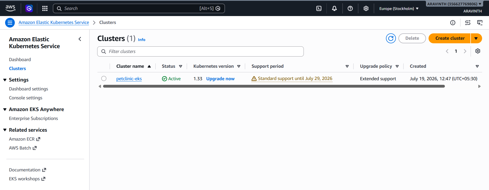

---

## EC2 Instances

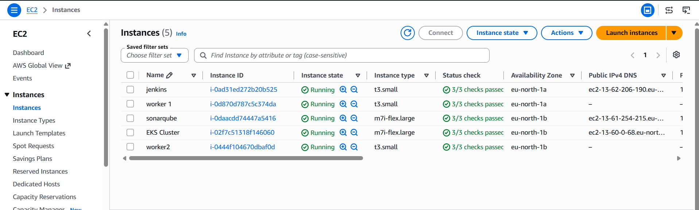

---

## Kubernetes Nodes

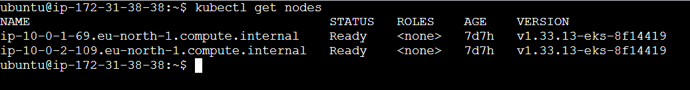

---

## Kubernetes Pods

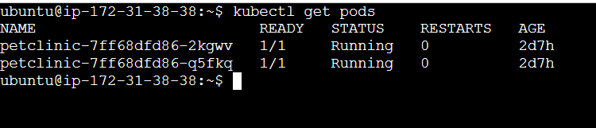

---

## Kubernetes Service

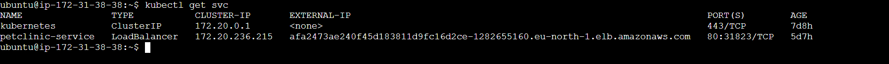

---

## Application Running

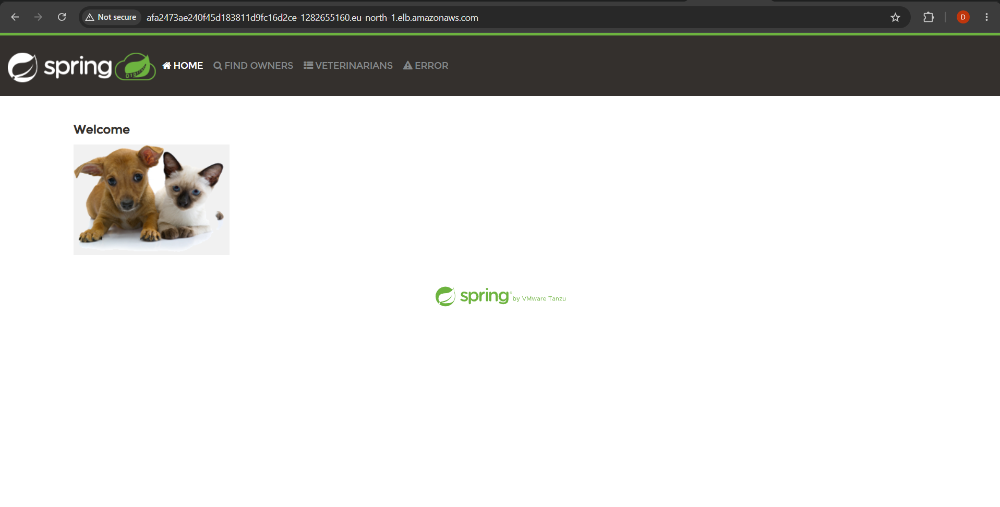

---

# What I Learned

Through this project I gained practical experience with:

- CI/CD Pipeline using Jenkins
- Git and GitHub
- Maven Build Automation
- Static Code Analysis using SonarQube
- Artifact Management using Nexus
- Docker Image Creation
- DockerHub Image Repository
- Kubernetes Deployments
- Amazon EKS
- Infrastructure as Code using Terraform
- Rolling Updates in Kubernetes
- Working with AWS EC2

---

# Future Improvements

- Add Monitoring using Prometheus and Grafana
- Deploy using Helm Charts
- Implement ArgoCD for GitOps
- Add Kubernetes Ingress with HTTPS

---

## Author

**Aravinth**

DevOps Fresher
